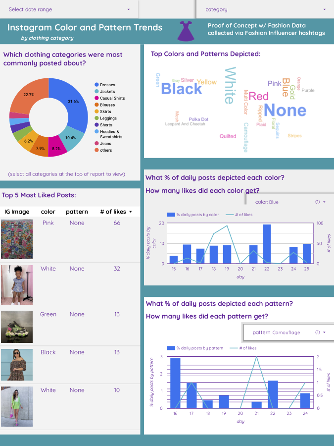

# The Flatiron School Capstone: Fashion Image Annotation for IG Trend Analysis

Morgan Fitzgerald, Flex 40 weeks, Instructor Abhineet Kulkarni

## Business Understanding

This project builds a proof of concept for a data pipeline that produces Instagram trend reports by using a neural network to annotate the clothing pictured in images with specific fashion attributes.

While hashtag and comment data is readily available, one cannot always ascertain the kind of clothing being pictured from this information.  When making marketing or product development decisions, trend data that includes more specific details on what clothing is being pictured could be very useful. Additionally, fashion influencers, journalists, and stylists could benefit from more detailed trend data.

Ultimately, the end user can view the data/results in a [Google Data Studio report](https://datastudio.google.com/reporting/8217e5f6-3bea-4639-9520-561dea3dbd0c) built from a MySQL Google Cloud database.  The report can be filtered to show different time frames and data from specific categories and also provides a view of the images with the most likes from the selected clothing category.

## Data Understanding 

The data used to train this model comes from the [iMaterialist fashion attribute dataset](https://arxiv.org/abs/1906.05750).  The dataset contains over a million images annotated with 8 different attributes.  Our model predicts three of these attributes: category, color and pattern.

Upon examination of the data ([data cleaning notebook in this repository](https://github.com/morganFitzg/fashion_annotation)), it was clear that there is a significant amount of mislabeled data and certain labels could easily be confounded.  For example there are separate labels for 'jeans' and 'skinny jeans', yet images of skinny jeans being labeled as 'jeans'. Care was taken to simplify some of these confusing categories and group similar categories where a distinction is not critical for trend analysis.  

After cleaning the data, the clothing category attribute has 57 different categories, pattern has 23 and color has 15.  

With such a large number of images, it was not possible in the timeframe allocated for this project to correct mislabeling, but to increase accuracy of the model it would be important increase the quality of the data.

## Model

The model performing annotations was built using transfer learning with the VGG16 image classification model as a backbone with three additional dense layers added with three branches, one for each attribute. The weights in the VGG16 layers were frozen during training.  Due to resource and time constraints, the model was trained on approximately 100,000 of the million images available. Training was performed in two rounds, two epochs each for two sets of approximately 50,000 images.

The overall performance for the model is not at the level that would be required to deploy for commercial use, but it is far better than random guessing.  Below are the validation accuracy scores for each attribute:

<ol>
<li>Category: 48%</li>
<li>Pattern: 75%</li>
<li>Color: 53%</li>
</ol>

There are a number of ways that accuracy could be increased given more time and resources for the project. A few are listed below:

<ol>
<li>Improve data labeling</li>
<li>Train the model on more images</li>
<li>Unfreeze the weights in VGG16 layers during training to fine tune</li>
<li>Add dense layers</li>
<li>Investigate categories that are frequently mislabeled</li>
<li>Try different loss function/optimizer</li>
</ol>

Ultimately, this project is more about a proof of concept and with 59, 23, and 15 categories respectively within each attribute the model is clearly achieving much higher accuracy than random guessing.  Research is ongoing in the field of image and especially fashion image annotation, as this is a challenging problem and a commercial grade model would require more time, resources, and perhaps some adjustments to the architecture.

Finally, there are limitations to this model that could be addressed with a more complex architecture. When finding attributes, this model assumes there is only one piece of clothing pictured. However, in many cases there would be multiple items such as a shirt and pants or a dress and jacket. There are neural networks designed to identify different clothing articles within an image (and locate them) allowing different attributes to be assigned to each article. However, this was outside the scope of this project. 

## Data Pipeline

The model is ultimately used to annotate fashion images from Instagram posts.  These images are collected using the Apify API to target fashion influencer hashtags.  After making annotations with the model, metadata and results are uploaded into a Google Cloud MySQL database.  A report was produced in Google Data Studio to show trend data. Below is a snapshot of the report.

## Conclusions

This project is a proof of concept that demonstrates how to provide more detailed Instagram fashion trend data to end users using a neural network that can assign three different attributes to pictured clothing. 

The model used is 48% accurate for category of clothing, 75% accurate for pattern, and 53% accurate for color. Due to resource and time constraints the model could not be developed further, but there are many avenues available to improve the outcomes and it already shows a much higher ability to assign annotations that random guessing among the options.

The report was produced using 6 hashtags popular among fashion influencers to retrieve fashion images from Instagram posts. However, to have a broad overview of fashion trend data it would be important to carefully select hashtags, consider targeting certain user accounts (known influencers or set threshold for minimum number of followers), and ensure a sufficient quantity is collected.  These adjustments could easily be made in the second notebook for the prediction pipeline after sufficient research was done.